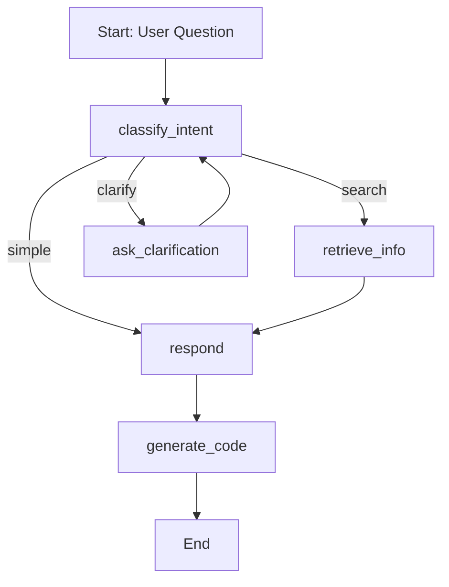

# 🧠 Statistical Test Recommender Agent (LangGraph + SciPy)

This project is an AI agent that helps you choose the most appropriate **statistical test** based on a natural language question. Built using **LangGraph**, **LangChain**, and a locally embedded version of the `scipy.stats` documentation, the agent even returns ready-to-run **Python code**.


---

## 🚀 Project Description

**"Which test should I use?"**  
Choosing the right statistical test can be confusing. This AI assistant breaks down your question, retrieves documentation if needed, asks clarifying questions, and recommends the correct test — plus generates the code using `scipy.stats`.

---

## 📦 Requirements

- `Python` 3.10+
- OpenAI API Key
- `chromadb` >= 1.0.16
- `langchain-chroma` >= 0.2.5
- `langchain-community` >= 0.3.27
- `langchain-openai` >= 0.3.28
- `langchain` >= 0.3.27
- `langgraph` >= 0.6.4
- `openai` >= 1.99.3
- `streamlit` >= 1.48.0
- `tiktoken` >= 0.10.0

--- 

## ▶️ How to Run

### Streamlit

1. Access the App on http...
2. Get an OpenAI API key and add that to the sidebar on the app.
3. Write a question about statistical tests
4. Hit **Search**.

### Locally

1. Clone this repo

```bash
git clone https://github.com/gurezende/AI-Statistical-Advisor.git
```

2. Run the app

```bash
stramlit run main.py
```


## 🧠 Code Structure

stat-test-advisor/ <br>
├── docs/                      *# Raw documentation (for RAG)* <br>
├── langgraph_agent/ <br>
│   ├── graph.py               *# LangGraph build logic* <br>
│   ├── nodes.py               *# All nodes (classify, clarify, retrieve, respond, code)* <br>
├── rag/ <br>
│   ├── embedder.py            *# Chunk + embed docs* <br>
│   ├── retriever.py           *# Load and query embedded docs* <br>
├── main.py                    *# CLI interface to run the agent* <br>
├── embed.py                   *# One-time embed script* <br>
├── requirements.txt <br>

## 🤖 Agent Logic (LangGraph)



## 💡 Demonstration

### Sample Input:

*I want to compare the means of two independent groups.*

### Output:


## 👨‍🔬 About

Created by [Gustavo R Santos](https://gustavorsantos.me) as a learning and teaching project using:

* LangGraph for agentic reasoning
* LangChain for RAG and embeddings
* SciPy for statistical tests

## 📄 License

Project licensed under MIt License.